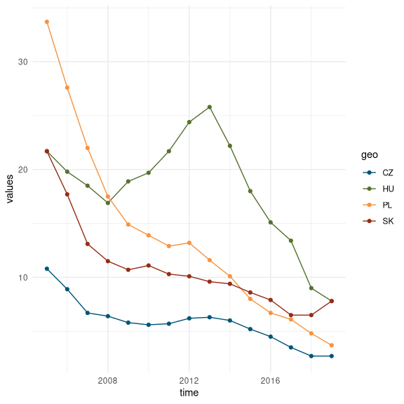

```r
library(tidyverse)
library(eurostat)
library(kimberlite)
```
With the exception of Hungary severe material deprivation rate (SMDR) declined unanimously after joining to the EU. Hungary was hit harder by the social outcomes of 2008 fincial crisis than Czechia, Poland or Slovakia. SDMR grew from n in 2008 to N in 2012. However, the austerity measures of social-liberal government and unorthodox economic policy of the second Orbán cabinet resuled in a decline of SDMR after 2012 in Hungary. Poland was far from the most effective in reducing SDMR among V4s.


Name of the indicator: Severe material deprivation rate (population aged 18 and over)
Indicator definition: [EUROSTAT glossay](https://ec.europa.eu/eurostat/statistics-explained/index.php?title=Glossary:Severe_material_deprivation_rate)
>
Code of indicator dataset in [Eurostat database](https://ec.europa.eu/eurostat/data/database): `ilc_mddd12`
EUROSTAT [Data Explorer](http://appsso.eurostat.ec.europa.eu/nui/show.do?dataset=ilc_mddd12&lang=en):

EUROSTAT: [Data Browser](https://ec.europa.eu/eurostat/databrowser/view/ilc_mddd12/default/table?lang=en)


> measures the percentage of the population that cannot afford at least three of the following nine items:
 - to pay their rent, mortgage or utility bills;
 - to keep their home adequately warm;
 - to face unexpected expenses;
 - to eat meat or proteins regularly;
 - to go on holiday;
 - a television set;
 - a washing machine;
 - a car;
 - a telephone.

>Severe material deprivation rate is defined as the enforced inability to pay for at least four of the above-mentioned items. 


```r
# Countries and Country Codes
as_tibble(eu_countries)
```

```
## # A tibble: 28 x 3
##    code  name     label                                           
##    <chr> <chr>    <chr>                                           
##  1 BE    Belgium  Belgium                                         
##  2 BG    Bulgaria Bulgaria                                        
##  3 CZ    Czechia  Czechia                                         
##  4 DK    Denmark  Denmark                                         
##  5 DE    Germany  Germany (until 1990 former territory of the FRG)
##  6 EE    Estonia  Estonia                                         
##  7 IE    Ireland  Ireland                                         
##  8 EL    Greece   Greece                                          
##  9 ES    Spain    Spain                                           
## 10 FR    France   France                                          
## # … with 18 more rows
```

```r
t1<-search_eurostat("Severe material deprivation")
t1 %>%
  select(title, code) %>%
  head()
```

```
## # A tibble: 6 x 2
##   title                                                                                           code      
##   <chr>                                                                                           <chr>     
## 1 Severe material deprivation rate by NUTS regions                                                ilc_mddd21
## 2 Severe material deprivation rate by degree of urbanisation                                      ilc_mddd23
## 3 Severe material deprivation by level of activity limitation, sex and age                        hlth_dm010
## 4 Severe material deprivation rate by age and sex                                                 ilc_mddd11
## 5 Severe material deprivation rate by most frequent activity status (population aged 18 and over) ilc_mddd12
## 6 Severe material deprivation rate by income quintile and household type                          ilc_mddd13
```

```r
df <- get_eurostat("ilc_mddd12", time_format = "num")
```

```
## Table ilc_mddd12 cached at /tmp/RtmpCFAah2/eurostat/ilc_mddd12_num_code_FF.rds
```

```r
v4 <- c("CZ", "HU", "PL", "SK")
df <- df %>%
  filter(time >= 2005 & wstatus == "POP" &
         age == "Y_GE18" & geo %in% v4 &
         sex == "T")
df
```

```
## # A tibble: 60 x 6
##    wstatus age    sex   geo    time values
##    <chr>   <chr>  <chr> <chr> <dbl>  <dbl>
##  1 POP     Y_GE18 T     CZ     2019    2.7
##  2 POP     Y_GE18 T     HU     2019    7.8
##  3 POP     Y_GE18 T     PL     2019    3.7
##  4 POP     Y_GE18 T     SK     2019    7.8
##  5 POP     Y_GE18 T     CZ     2018    2.7
##  6 POP     Y_GE18 T     HU     2018    9  
##  7 POP     Y_GE18 T     PL     2018    4.8
##  8 POP     Y_GE18 T     SK     2018    6.5
##  9 POP     Y_GE18 T     CZ     2017    3.5
## 10 POP     Y_GE18 T     HU     2017   13.4
## # … with 50 more rows
```

```r
p1 <- df %>%
  ggplot(aes(time, values, color = geo)) +
  geom_line() +
  geom_point() +
  scale_color_kimberlite() +
  theme_minimal()
p1
```



References:
[Tutorial for the eurostat R package](http://ropengov.github.io/eurostat/articles/website/eurostat_tutorial.html)


