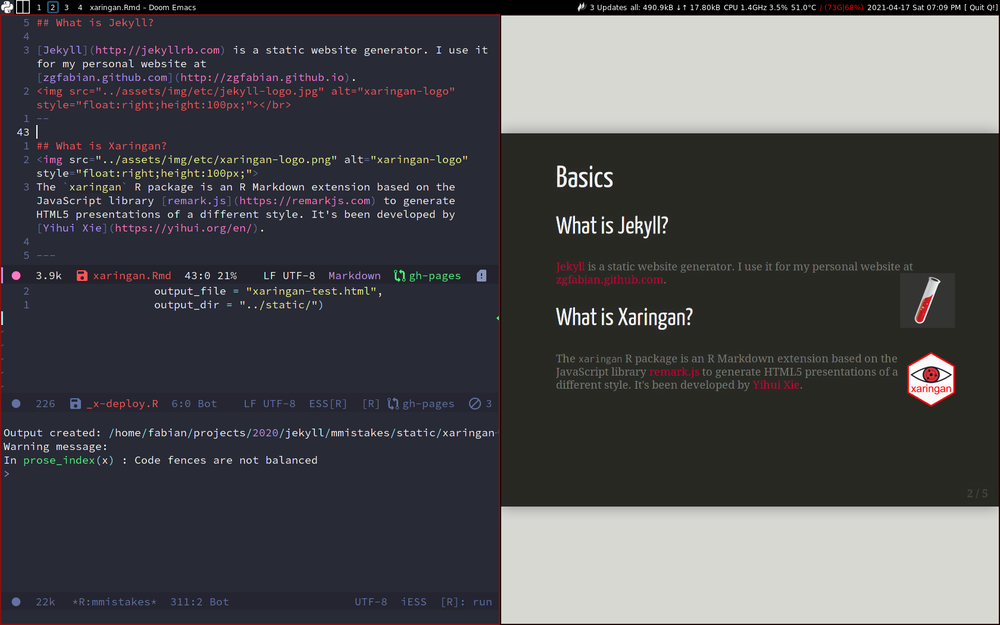

class: middle


>The name “xaringan” came from [Sharingan](http://naruto.wikia.com/wiki/Sharingan) in the Japanese manga and anime “Naruto.” The word was deliberately chosen to be difficult to pronounce for most people (unless you have watched the anime), because its author (me) loved the style very much, and was concerned that it would become too popular. The concern was somewhat naive, because the style is actually very customizable, and users started to contribute more themes to the package later. - [Yihui Xie](https://bookdown.org/yihui/rmarkdown/xaringan.html)


---
class: center, middle, inverse

.left-column[]
.right-column[
# Xaringan in a Jekyll site

## .center[Made with Xaringan Rstat library]
<br><br><br><br><br>


.right[Zoltán Fábián]
.right[2021-04-18]
]
---
class: inverse

# Basics

## What is Jekyll?

[Jekyll](http://jekyllrb.com) is a static website generator. I use it for my personal website at [zgfabian.github.com](http://zgfabian.github.io). 
</br>
--

## What is Xaringan?

The `xaringan` R package is an R Markdown extension based on the JavaScript library [remark.js](https://remarkjs.com) to generate HTML5 presentations of a different style. It's been developed by [Yihui Xie](https://yihui.org/en/).

.footnote["In the anime and manga series Naruto, the Sharingan is an ability that allows a ninja to copy, by mere sight, their opponents' techniques while gaining incredible reflexes and perceptive abilities."]
---

# Xaringan overview


```r
# install
install.packages("xaringan")
# list available theme (+font) names
names(xaringan:::list_css())
```

## Some features of Xaringan

- Based on Rmarkdown and require some html, css and optimally js knowledge
- Built-in css themes and theme customisation made easy with `xaringanthemer` package
- online and offline presentations
- pdf output with other packages (e.g. `pagedown`) or system tools ([See details here.](https://github.com/yihui/xaringan/wiki/Export-Slides-to-PDF))
- slide separator: `---`
- incremental reveal separator: `--`
- presenter notes separator: `???`

---
- to create custom xaringan themes [`xaringanthemer`](https://cran.r-project.org/web/packages/xaringanthemer/vignettes/xaringanthemer.html) package is at your hand

- [`xaringanExtra` package](https://pkg.garrickadenbuie.com/xaringanExtra/) for advanced effects and layouts

- for more output formats, use [xaringanBuilder`](https://github.com/jhelvy/xaringanBuilder). It can produce even gifs that everybody love (Not really.)


- press `?` to see features
  - (`p`) presenter mode and cloning: show the (`???`) notes and timer on your screen and the clone on the projector
  - `f` fullscreen

???

Here's a list of stuff to say:

- some notes to myself
- more stuff

---
# Configuration in Jekyll
<hr>
Xaringan presentations are [Rmarkdown]() files. I configured Jekyll to exclude them from rendering. Cf. Jekyll's `_config.yml`:

```
exclude:
  - "*.Rmd"
  ...
```

Usually, I keep my Rmd files under `_drafts` folder, so it is not served by Jekyll. I am also keeping out this folder from github deployment by adding to `.gitignore` file.

???

Wow, this even does presenter notes. 

---

# File locations

- `remark.js` is served from a project folder. (In my case on [`minimal-mistake` Jekyll theme](https://github.com/mmistakes/minimal-mistakes) it is `./assets/js/` folder)

```
output:
  xaringan::moon_reader:
    chakra: ../assets/js/remark-latest.min.js
```
Note: Mind your `remark.js` version. Xariangan provides a dedicated function, (`summon_remark`) to download the proper version of the `remark.js` script to your local disk, so you can render slides offline. You need to change the `chakra` argument of `moon_reader()` accordingly. 

- header customization for proper favicon display

`Xaringan Rmd yaml front matter`
 
```
output:
  xaringan::moon_reader:
    ...
    includes:
      in_header: ../_includes/head/favicon-xaringan.html
 ```

---
class: middle, center

# Doom Emacs + ESS + Surf preview

Doom Emacs + Emacs Speaks Statistics (ESS)) and Xaringan preview in Surf browser as an IDE



---
# Further resources


- [remarkjs.com - website](https://remarkjs.com/)

- xaringan in the Rmarkdown book - https://bookdown.org/yihui/rmarkdown/xaringan.html

- https://www.rstudio.com/wp-content/uploads/2015/03/rmarkdown-reference.pdf

# Other presentation tools

- Beamer

- Standalone remark.js

- Reveal.js

- Sozi, SVG-based zoom-in/out Prezi-like tool

- Horribile dictu: Powerpoint


