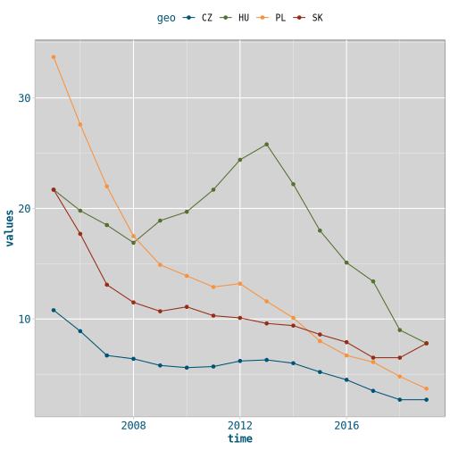

With the exception of Hungary severe material deprivation rate (SMDR) declined unanimously in V4 countries after the EU accession. Hungary  was hit harder by the social outcomes of 2008 financial crisis than Czechia, Poland or Slovakia. SMDR grew from 17 percent in 2008 to 26 percent point in 2013. However, the austerity measures of social-liberal government and unorthodox economic policy of the second Orbán cabinet resulted in a decline of SMDR after 2013 in Hungary. However, Poland was a real "fairy tale"[^1] among V4s in reducing SMDR to one tenth of its 2005 value. 

[^1]:To paraphrase György Matolcsy, president of the National Bank of Hungary who gave an interview to CNN in 2012. He used this term for Hungary's economic prospects.

The following plots on SMDR were made with R using `eurostat` and `tidyverse` packages with my ricing.


```r
library(tidyverse)
library(eurostat)
# devtools::install_github("zgfabian/kimberlite")
library(kimberlite)
```
 

```r
df <- get_eurostat("ilc_mddd12", time_format = "num")
v4 <- c("CZ", "HU", "PL", "SK")
df1 <- df %>%
  filter(time >= 2005 & wstatus == "POP" &
         age == "Y_GE18" & geo %in% v4 &
         sex == "T")
p1 <- df1 %>%
  ggplot(aes(time, values, color = geo, shape = geo)) +
  geom_line(size = 1) +
  geom_point(size = 3) +
  labs(title = "Severe material deprivation rate in V4 countries",
       subtitle = "2005-2019",
       caption = "data source: Eurostat") +
  scale_color_kimberlite() +
  theme_kimberlite() +
  theme(axis.title = element_blank(), legend.title = element_blank())
p1
```




Table: SMDR between 2005-2019

| time|   CZ|   HU|   PL|   SK|
|----:|----:|----:|----:|----:|
| 2005| 10.8| 21.7| 33.7| 21.7|
| 2006|  8.9| 19.8| 27.6| 17.7|
| 2007|  6.7| 18.5| 22.0| 13.1|
| 2008|  6.4| 16.9| 17.5| 11.5|
| 2009|  5.8| 18.9| 14.9| 10.7|
| 2010|  5.6| 19.7| 13.9| 11.1|
| 2011|  5.7| 21.7| 12.9| 10.3|
| 2012|  6.2| 24.4| 13.2| 10.1|
| 2013|  6.3| 25.8| 11.6|  9.6|
| 2014|  6.0| 22.2| 10.1|  9.4|
| 2015|  5.2| 18.0|  8.0|  8.6|
| 2016|  4.5| 15.1|  6.7|  7.9|
| 2017|  3.5| 13.4|  6.1|  6.5|
| 2018|  2.7|  9.0|  4.8|  6.5|
| 2019|  2.7|  7.8|  3.7|  7.8|

{: .notice--info}
**material deprivation rate** is the percentage of the population that cannot afford at least three of the following nine items: (1) to pay their rent, mortgage or utility bills; (2) to keep their home adequately warm; (3) to face unexpected expenses; (4) to eat meat or proteins regularly; (5) to go on holiday; (6) a television set; (7) a washing machine; (8) a car; (9) a telephone. **Severe material deprivation rate** is defined as the enforced inability to pay for at least four of the above-mentioned items. _Source:_ [EUROSTAT glossary](https://ec.europa.eu/eurostat/statistics-explained/index.php?title=Glossary:Severe_material_deprivation_rate)

- Browse [Eurostat database](https://ec.europa.eu/eurostat/data/database)
- Browse `ilc_mddd12` in the EUROSTAT [**Data Explorer**](http://appsso.eurostat.ec.europa.eu/nui/show.do?dataset=ilc_mddd12&lang=en)
- Browse `ilc_mddd12` in the EUROSTAT: [**Data Browser**](https://ec.europa.eu/eurostat/databrowser/view/ilc_mddd12/default/table?lang=en)

[{: width="250px" .align-center}]({{ site.baseurl }}/assets/img/21-02-22-eurostat/screenshot.png)


[Tutorial for the eurostat R package](http://ropengov.github.io/eurostat/articles/website/eurostat_tutorial.html)

